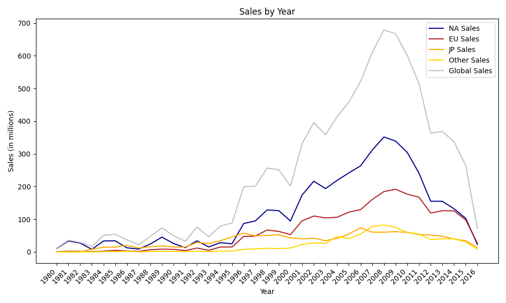
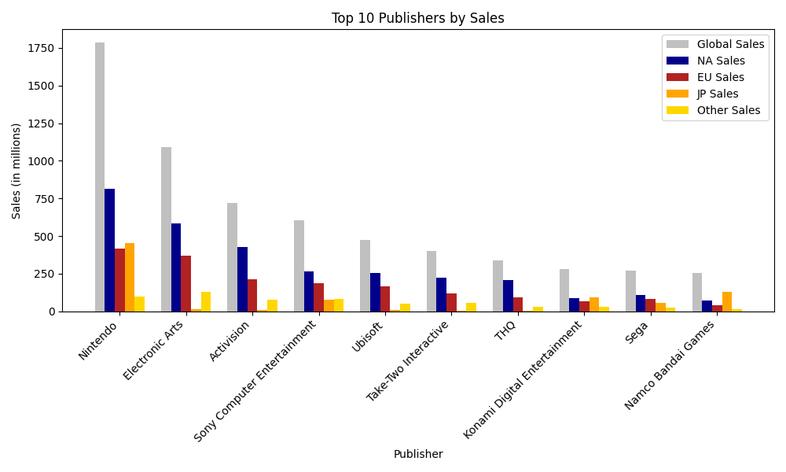
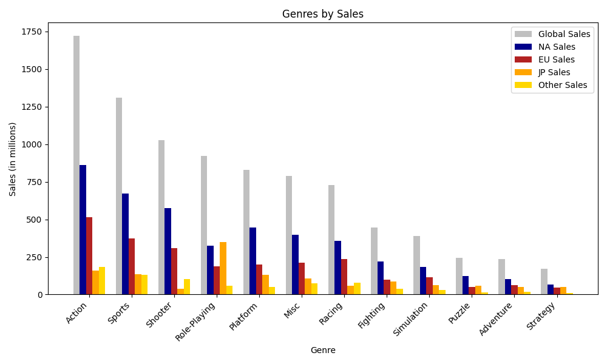
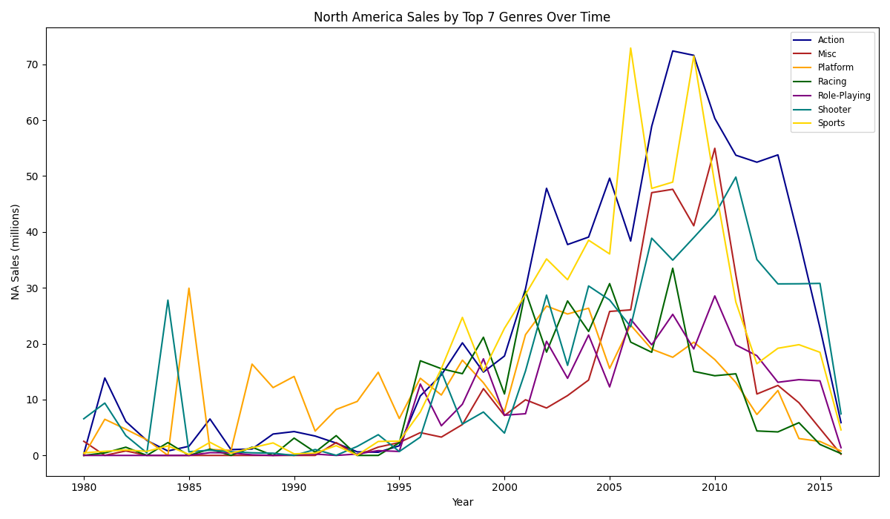
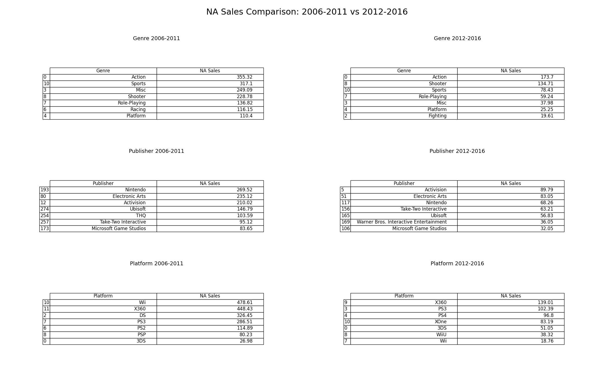
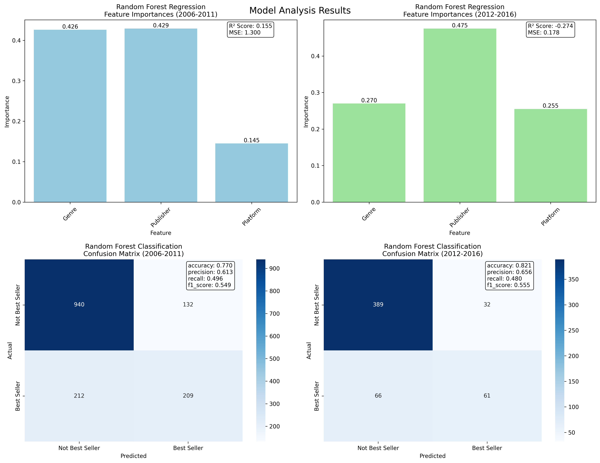

# Video Game Sales Analyses

## Summary of the Dataset
[Open file](data/summary.txt)

## Analysis
### All Regions
  

  

  

### North America Sales

  

  

## Model Analysis

#### Regression Analysis
- The regression model predicts global sales based on genre, publisher, and platform
- Feature importance analysis shows how each factor contributes to sales predictions

#### Classification Analysis
- The classification model predicts whether a game will be successful (above average sales)
- These metrics help evaluate the model's ability to identify successful games

## Data  
https://www.kaggle.com/code/upadorprofzs/eda-video-game-sales  

## Setup
Framework: Flask  

### IDE
PyCharm Professional 2025.1  

## Run Docker
if __name__ == "__main__":  
    app.run(host="0.0.0.0", port=5000, debug=False)  
docker build -t vg-sales-analysis .  
docker run -p 5000:5000 vg-sales-analysis  